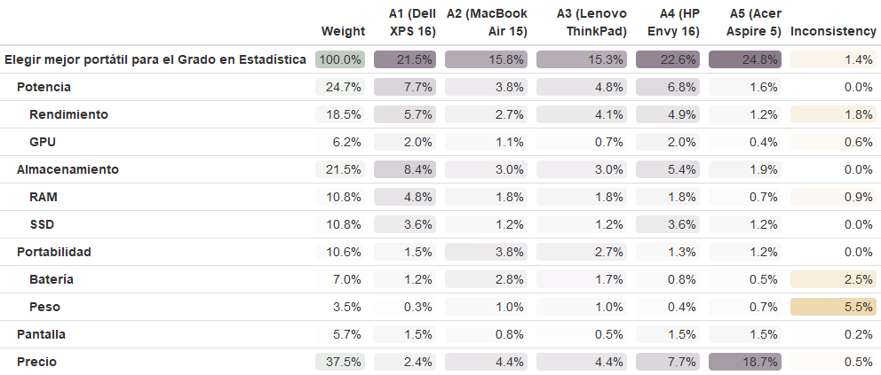
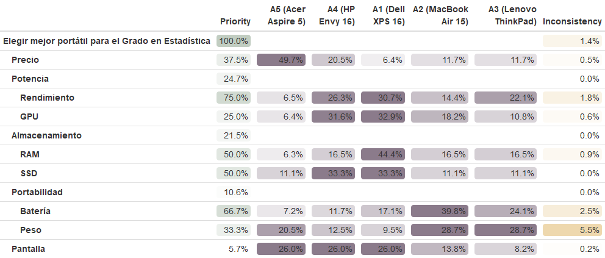

```{r setup, include=FALSE}
knitr::opts_chunk$set(echo = TRUE)
```

```{r include=FALSE}
#Cargar funciones necesarias
source("teoriadecision_funciones_multicriterio.R")
source("teoriadecision_funciones_multicriterio_diagram.R")
source("teoriadecision_funciones_multicriterio_utiles.R")
```

\newpage

# Introducción

La selección del ordenador portátil óptimo para un estudiante de Estadística es un problema de decisión compleja que requiere sopesar múltiples criterios como el rendimiento del hardware, la movilidad y el coste. El presente trabajo aborda esta necesidad mediante la aplicación y comparación de las principales metodologías de Decisión Multicriterio (DMC): el Proceso Analítico Jerárquico (AHP), ELECTRE y PROMETHEE.

# Definición del Problema 

## Alternativas

Las alternativas de portátiles a evaluar son:

* Apple MacBook Pro (M-series)
* Dell XPS (15 o 16)
* Lenovo ThinkPad Serie P o T
* HP Spectre o Envy
* Acer Aspire o Asus VivoBook

## Jerarquía de Criterios y Subcriterios

Para satisfacer el requisito de estructuración en **varios niveles de subcriterios**, el problema se modela con cinco Criterios Principales de Nivel 1, bajo los cuales se distribuyen los ocho factores específicos de evaluación (Subcriterios de Nivel 2).

### Criterio I: Potencia de Cálculo (2 Subcriterios)
Este grupo es esencial para el procesamiento intensivo, las simulaciones y el análisis de grandes datos.

* **Subcriterio:** **Rendimiento del procesador** (Objetivo: Maximizar). La velocidad y capacidad de cálculo son esenciales para la ejecución de scripts pesados.
* **Subcriterio:** **GPU (Gráfica Dedicada)** (Objetivo: Maximizar). Relevante para el cálculo paralelo y la aceleración en tareas de Deep Learning o visualización intensiva.

### Criterio II: Almacenamiento y Memoria (2 Subcriterios)
Este grupo se centra en la capacidad del sistema para gestionar grandes conjuntos de datos y la multitarea eficiente.

* **Subcriterio:** **Memoria RAM** (Objetivo: Maximizar). Crucial para manejar grandes conjuntos de datos y evitar cuellos de botella al ejecutar múltiples entornos de análisis.
* **Subcriterio:** **Capacidad de almacenamiento** (Objetivo: Maximizar). Un mayor almacenamiento (GB SSD) permite guardar grandes conjuntos de datos y software especializado.

### Criterio III: Portabilidad (2 Subcriterios)
Este grupo agrupa los factores relacionados con la movilidad y la usabilidad fuera de un entorno fijo.

* **Subcriterio:** **Duración de la batería** (Objetivo: Maximizar). La autonomía es crucial para largas jornadas de estudio sin acceso a enchufes.
* **Subcriterio:** **Peso** (Objetivo: Minimizar). Un menor peso mejora la portabilidad y comodidad para el transporte diario.

### Criterio IV: Experiencia Visual (1 Subcriterio)
Este grupo se centra en la comodidad del usuario durante las horas de programación y visualización de datos.

* **Subcriterio:** **Tamaño de la pantalla** (Objetivo: Maximizar). Una pantalla más grande mejora la experiencia visual y facilita el trabajo con múltiples ventanas y gráficos.

### Criterio V: Economía (1 Subcriterio)
Este grupo contiene el único factor asociado a la inversión financiera.

* **Subcriterio:** **Precio** (Objetivo: Minimizar). El coste es un factor decisivo de restricción presupuestaria.

## Matriz de Decisión Inicial

La matriz de decisión se construye con las cinco alternativas de portátiles y los **ocho Subcriterios de Nivel 2** (agrupados bajo cinco Criterios Principales), utilizando datos reales estimados de configuraciones típicas del mercado actual.

```{r matriz_decision, echo=FALSE}
library(knitr)
library(kableExtra)

#Definir los datos (Subcriterios en la primera columna)
matriz_data <- data.frame(
  Criterio = c("Precio (€)", "Rend. Procesador (CB R23 Score)", "Memoria RAM (GB)", "GPU (Gráfica, Valor 1-10)", "Capacidad Almacenamiento (GB SSD)", "Duración de la Batería (Horas)", "Peso (kg)", "Tamaño de la Pantalla (Pulgadas)"),
  A1_Dell = c(2400, 16500, 32, 8, 1000, 10, 2.1, 16.0),
  A2_MacBook = c(1550, 12800, 16, 3, 512, 17, 1.5, 15.3),
  A3_Lenovo = c(1700, 13500, 16, 2, 512, 12, 1.3, 14.0),
  A4_HP = c(1300, 14000, 16, 4, 1000, 8, 1.9, 16.0),
  A5_Acer = c(750, 8500, 8, 1, 512, 6, 1.7, 15.6),
  Objetivo = c("Min", "Max", "Max", "Max", "Max", "Max", "Min", "Max"),
  stringsAsFactors = FALSE
)

#Generar la tabla con kable y kableExtra
matriz_data %>%
  kable(
    format = "latex", 
    caption = "Matriz de Decisión Inicial",
    col.names = c("Subcriterio", "A1: Dell XPS 16", "A2: MacBook Air 15", "A3: ThinkPad T14s", "A4: HP Envy 16", "A5: Aspire 5", "Objetivo"),
    align = c('l', rep('c', ncol(matriz_data) - 1))) %>% 
  column_spec(1, width = "5cm", bold = T) %>%
  add_header_above(c(" " = 1, "Alternativas de Portátil" = 5, " " = 1)) %>%
  kable_styling(latex_options = c("HOLD_position", "scale_down"), full_width = F)
```

```{r}
matriz_decision = multicriterio.crea.matrizdecision(
  c(-2400, 16500, 32, 8, 1000, 10, -2.1, 16.0,
    -1550, 12800, 16, 3, 512, 17, -1.5, 15.3,
    -1700, 13500, 16, 2, 512, 12, -1.3, 14.0,
    -1300, 14000, 16, 4, 1000, 8, -1.9, 16.0,
    -750, 8500, 8, 1, 512, 6, -1.7, 15.6), 
  numalternativas = 5,
  numcriterios = 8,
  v.nombrescri = c("C1", "C2", "C3", "C4", "C5", "C6", "C7", "C8"),
  v.nombresalt = c("A1", "A2", "A3", "A4", "A5")
)
matriz_decision
```

# Metodología I: Proceso Analítico Jerárquico (AHP)

```{r include=FALSE}
###PASOS INICIALES
library(formattable)
library(htmltools)
library(webshot)
export_formattable<-function(f,file,width="100%",height=NULL, background="white",delay=0.2){
 w<-formattable::as.htmlwidget(f, width=width,height=height)
 path<-htmltools::html_print(w, background=background,viewer=NULL)
 url<-paste0("file:///",gsub("\\\\","/",normalizePath(path)))
 webshot::webshot(url, file=file, selector=".formattable_widget", delay=delay)
}
```

## Matriz de Criterios 

| Criterio | Precio | Rend. | RAM | GPU | SSD | Batería | Peso | Pantalla |
| :---: | :---: | :---: | :---: | :---: | :---: | :---: | :---: | :---: |
| **Precio** | 1 | 1/2 | 2 | 5 | 5 | 1/3 | 5 | 5 |
| **Rendimiento** | 2 | 1 | 2 | 5 | 5 | 3 | 5 | 5 |
| **RAM** | 1/2 | 1/2 | 1 | 3 | 3 | 2 | 3 | 3 |
| **GPU** | 1/5 | 1/5 | 1/3 | 1 | 1 | 1/2 | 1 | 1 |
| **SSD** | 1/5 | 1/5 | 1/3 | 1 | 1 | 1/2 | 1 | 1 |
| **Batería** | 3 | 1/3 | 1/2 | 2 | 2 | 1 | 2 | 2 |
| **Peso** | 1/5 | 1/5 | 1/3 | 1 | 1 | 1/2 | 1 | 1 |
| **Pantalla** | 1/5 | 1/5 | 1/3 | 1 | 1 | 1/2 | 1 | 1 |

```{r echo=FALSE}
M_Criterios = multicriterio.crea.matrizvaloraciones_mej(
c(2, 1/2, 1/5, 1/5, 3, 1/5, 1/5, # C1
  1/2, 1/5, 1/5, 1/3, 1/5, 1/5, # C2
  1/3, 1/3, 1/2, 1/3, 1/3, # C3
  1, 1/2, 1, 1, # C4
  1/2, 1, 1, # C5
  1/2, 1/2, # C6
  1 # C7
  ),
  numalternativas = 8,
  v.nombres.alternativas = c("Precio", "Rendimiento", "RAM", "GPU", "SSD", "Batería", "Peso", "Pantalla")
)
```

\newpage
## Matrices Alternativas-Criterios
**Criterio C1 (Precio) - Minimizar**

| Alt. | A1 | A2 | A3 | A4 | A5 |
| :---: | :---: | :---: | :---: | :---: | :--- |
| **A1** | 1 | 1/2 | 1/2 | 1/3 | 1/7 |
| **A2** | 2 | 1 | 1 | 1/2 | 1/4 | 
| **A3** | 2 | 1 | 1 | 1/2 | 1/4 | 
| **A4** | 3 | 2 | 2 | 1 | 1/3 | 
| **A5** | 7 | 4 | 4 | 3 | 1 | 

**Razón de los Juicios:**

* **Objetivo**: Minimizar el precio. $A_5$ (750 €) es la mejor; $A_1$ (2400 €) es la peor.
* $A_5$ vs $A_1$ (Juicio 7): $A_5$ es muy fuertemente superior a $A_1$ debido a la gran diferencia de precio.
* $A_4$ vs $A_2$ (Juicio 2): $A_4$ (1300 €) es moderadamente mejor que $A_2$ (1550 €).
* $A_2$ vs $A_3$ (Juicio 1): $A_2$ (1550 €) y $A_3$ (1700 €) se consideran de igual importancia, ya que la diferencia de precio es pequeña y ambos son caros.

**Criterio C2 Rend.Procesador - Maximizar**

| Alt. | A1 | A2 | A3 | A4 | A5 | 
| :---: | :---: | :---: | :---: | :---: | :--- |
| **A1** | 1 | 2 | 2 | 1 | 4 | 
| **A2** | 1/2 | 1 | 1/2 | 1/2 | 3 | 
| **A3** | 1/2 | 2 | 1 | 1 | 3 | 
| **A4** | 1 | 2 | 1 | 1 | 4 | 
| **A5** | 1/4 | 1/3 | 1/3 | 1/4 | 1 | 

**Razón de los Juicios:**

* **Objetivo**: Maximizar el rendimiento. $A_1$ (16500) es la mejor; $A_5$ (8500) es la peor.
* $A_1$ vs $A_4$ (Juicio 1): $A_1$ (16500) y $A_4$ (14000) son considerados de igual importancia debido a que ambos son puntajes altos en el contexto del problema.
* $A_1$ vs $A_5$ (Juicio 4): $A_1$ es claramente mejor que $A_5$, dada la gran diferencia de rendimiento.
* $A_3$ vs $A_2$ (Juicio 2): $A_3$ (13500) es moderadamente mejor que $A_2$ (12800).

\newpage
**Criterio C3: Memoria RAM (GB) - Maximizar**

| Alt. | A1 | A2 | A3 | A4 | A5 | 
| :---: | :---: | :---: | :---: | :---: | :--- |
| **A1** | 1 | 3 | 3 | 3 | 5 | 
| **A2** | 1/3 | 1 | 1 | 1 | 3 |
| **A3** | 1/3 | 1 | 1 | 1 | 3 | 
| **A4** | 1/3 | 1 | 1 | 1 | 3 |
| **A5** | 1/5 | 1/3 | 1/3 | 1/3 | 1 |

**Razón de los Juicios:**

* **Objetivo**: Maximizar la RAM. $A_1$ (32 GB) es la mejor; $A_5$ (8 GB) es la peor.
* $A_1$ vs $A_2, A_3, A_4$ (Juicio 3): $A_1$ tiene el doble de RAM (32 GB vs 16 GB), por lo que es moderadamente superior.
* $A_2, A_3, A_4$ vs $A_5$ (Juicio 3): Los de 16 GB son moderadamente superiores al de 8 GB.
* $A_2$ vs $A_3$ (Juicio 1): Todas las alternativas de 16 GB tienen igual importancia.

**Criterio C4: GPU (Gráfica, Valor 1-10) - Maximizar**

| Alt. | A1 | A2 | A3 | A4 | A5 | 
| :---: | :---: | :---: | :---: | :---: | :--- |
| **A1** | 1 | 2 | 3 | 1 | 5 | 
| **A2** | 1/2 | 1 | 2 | 1/2 | 3 |
| **A3** | 1/3 | 1/2 | 1 | 1/3 | 2 |
| **A4** | 1 | 2 | 3 | 1 | 4 | 
| **A5** | 1/5 | 1/3 | 1/2 | 1/4 | 1 | 

**Razón de los Juicios:**

* **Objetivo**: Maximizar el valor de GPU. $A_1$ y $A_4$ son las mejores; $A_5$ es la peor.
* $A_1$ vs $A_4$ (Juicio 1): $A_1$ (8) y $A_4$ (4) se consideran de igual importancia para una GPU de alta gama (asumiendo que 8 es el máximo). 
* $A_1$ vs $A_2$ (Juicio 2): $A_1$ (8) es moderadamente mejor que $A_2$ (3).
* $A_4$ vs $A_3$ (Juicio 3): $A_4$ (4) es moderadamente mejor (3) que $A_3$ (2).

**Criterio C5: Capacidad Almacenamiento (GB SSD) - Maximizar**

| Alt. | A1 | A2 | A3 | A4 | A5 | 
| :---: | :---: | :---: | :---: | :---: | :--- |
| **A1** | 1 | 3 | 3 | 1 | 3 | 
| **A2** | 1/3 | 1 | 1 | 1/3 | 1 |
| **A3** | 1/3 | 1 | 1 | 1/3 | 1 |
| **A4** | 1 | 3 | 3 | 1 | 3 | 
| **A5** | 1/3 | 1 | 1 | 1/3 | 1 | 

\newpage
**Razón de los Juicios:**

* **Objetivo**: Maximizar el SSD. $A_1$ y $A_4$ (1000 GB) son las mejores; $A_2, A_3, A_5$ (512 GB) son las peores.
* $A_1$ vs $A_4$ (Juicio 1): Tienen la misma capacidad, por lo que son de igual importancia.
* $A_1$ vs $A_2$ (Juicio 3): 1000 GB es moderadamente mejor que 512 GB.
* $A_2$ vs $A_3$ (Juicio 1): Todas las alternativas de 512 GB son de igual importancia.

**Criterio C6: Duración de la Batería (Horas) - Maximizar**

| Alt. | A1 | A2 | A3 | A4 | A5 | 
| :---: | :---: | :---: | :---: | :---: | :--- |
| **A1** | 1 | 1/3 | 1/2 | 2 | 3 | 
| **A2** | 3 | 1 | 2 | 3 | 4 | 
| **A3** | 2 | 1/2 | 1 | 2 | 3 | 
| **A4** | 1/2 | 1/3 | 1/2 | 1 | 2 | 
| **A5** | 1/3 | 1/4 | 1/3 | 1/2 | 1 | 

**Razón de los Juicios:**

* **Objetivo**: Maximizar la batería. $A_2$ (17h) es la mejor; $A_5$ (6h) es la peor.
* $A_2$ vs $A_3$ (Juicio 2): $A_2$ (17h) es moderadamente mejor que $A_3$ (12h).
* $A_3$ vs $A_1$ (Juicio 2): $A_3$ (12h) es moderadamente mejor que $A_1$ (10h).
* $A_2$ vs $A_5$ (Juicio 4): $A_2$ es claramente mejor que $A_5$.

**Criterio C7: Peso (kg) - Minimizar**

| Alt. | A1 | A2 | A3 | A4 | A5 | 
| :---: | :---: | :---: | :---: | :---: | :--- |
| **A1** | 1 | 1/2 | 1/3 | 1/2 | 1/2 | 
| **A2** | 2 | 1 | 2 | 2 | 1 | 
| **A3** | 3 | 1/2 | 1 | 3 | 2 | 
| **A4** | 2 | 1/2 | 1/3 | 1 | 1/2 | 
| **A5** | 2 | 1 | 1/2 | 2 | 1 | 

**Razón de los Juicios:**

* **Objetivo**: Minimizar el peso. $A_3$ (1.3 kg) es la mejor; $A_1$ (2.1 kg) es la peor.
* $A_3$ vs $A_1$ (Juicio 3): $A_3$ es claramente mejor que $A_1$ (el más pesado).
* $A_2$ vs $A_5$ (Juicio 1): $A_2$ (1.5 kg) y $A_5$ (1.7 kg) tienen igual importancia en cuanto a peso ligero.
* $A_2$ vs $A_3$ (Juicio 1/2): $A_3$ es ligeramente más liviana, por lo que $A_2$ es ligeramente superada ($1/2$).

**Criterio C8: Tamaño de la Pantalla (Pulgadas) - Maximizar**

| Alt. | A1 | A2 | A3 | A4 | A5 | 
| :---: | :---: | :---: | :---: | :---: | :--- |
| **A1** | 1 | 2 | 3 | 1 | 1 | 
| **A2** | 1/2 | 1 | 2 | 1/2 | 1/2 |
| **A3** | 1/3 | 1/2 | 1 | 1/3 | 1/3 |
| **A4** | 1 | 2 | 3 | 1 | 1 | 
| **A5** | 1 | 2 | 3 | 1 | 1 | 

**Razón de los Juicios:**

* **Objetivo**: Maximizar la pantalla. $A_1, A_4, A_5$ son las mejores; $A_3$ es la peor.
* $A_1$ vs $A_4$ (Juicio 1): $A_1$ (16.0") y $A_4$ (16.0") son iguales.
* $A_5$ vs $A_2$ (Juicio 2): $A_5$ (15.6") es moderadamente mejor que $A_2$ (15.3").
* $A_1$ vs $A_3$ (Juicio 3): $A_1$ (16.0") es claramente mejor que $A_3$ (14.0").

``` {r include=FALSE}
n.alternativas = c("A1", "A2", "A3", "A4", "A5")
tabC1_Precio = multicriterio.crea.matrizvaloraciones_mej(
  c(2, 2, 3, 7, 1, 2, 4, 2, 4, 3), 
  numalternativas = 5, v.nombres.alternativas = n.alternativas
)
tabC2_Procesador = multicriterio.crea.matrizvaloraciones_mej(
  c(1/2, 1/2, 1, 1/4, 2, 2, 1/3, 1, 1/3, 1/4),
  numalternativas = 5, v.nombres.alternativas = n.alternativas
)
tabC3_RAM = multicriterio.crea.matrizvaloraciones_mej(
  c(1/3, 1/3, 1/3, 1/5, 1, 1, 1/3, 1, 1/3, 1/3),
  numalternativas = 5, v.nombres.alternativas = n.alternativas
)
tabC4_GPU = multicriterio.crea.matrizvaloraciones_mej(
  c(1/2, 1/3, 1, 1/5, 1/2, 2, 1/3, 3, 1/2, 1/4),
  numalternativas = 5, v.nombres.alternativas = n.alternativas
)
tabC5_SSD = multicriterio.crea.matrizvaloraciones_mej(
  c(1/3, 1/3, 1, 1/3, 1, 3, 1, 3, 1, 1/3),
  numalternativas = 5, v.nombres.alternativas = n.alternativas
)
tabC6_Bateria = multicriterio.crea.matrizvaloraciones_mej(
  c(3, 2, 1/2, 1/3, 1/2, 1/3, 1/4, 1/2, 1/3, 1/2),
  numalternativas = 5, v.nombres.alternativas = n.alternativas
)
tabC7_Peso = multicriterio.crea.matrizvaloraciones_mej(
  c(2, 3, 2, 2, 1/2, 1/2, 1, 1/3, 1/2, 2),
  numalternativas = 5, v.nombres.alternativas = n.alternativas
)
tabC8_Pantalla = multicriterio.crea.matrizvaloraciones_mej(
  c(1/2, 1/3, 1, 1, 1/2, 2, 2, 3, 3, 1),
  numalternativas = 5, v.nombres.alternativas = n.alternativas
)
```

## Con ayuda de las funciones R de clase
### Método 1: mayor autovalor

**Pesos Locales**
```{r}
prioridad_criterios <-multicriterio.metodoAHP.variante1.autovectormayorautovalor(M_Criterios)
prioridad_precio <- multicriterio.metodoAHP.variante1.autovectormayorautovalor(tabC1_Precio)
prioridad_rendimiento <- multicriterio.metodoAHP.variante1.autovectormayorautovalor(tabC2_Procesador)
prioridad_RAM <- multicriterio.metodoAHP.variante1.autovectormayorautovalor(tabC3_RAM)
prioridad_GPU <- multicriterio.metodoAHP.variante1.autovectormayorautovalor(tabC4_GPU)
prioridad_SSD <- multicriterio.metodoAHP.variante1.autovectormayorautovalor(tabC5_SSD)
prioridad_bateria <- multicriterio.metodoAHP.variante1.autovectormayorautovalor(tabC6_Bateria)
prioridad_peso <- multicriterio.metodoAHP.variante1.autovectormayorautovalor(tabC7_Peso)
prioridad_pantalla <- multicriterio.metodoAHP.variante1.autovectormayorautovalor(tabC8_Pantalla)

```

\newpage
**Pesos Globales**
```{r}
matriz_prioridades_alternativas <- rbind(
  prioridad_precio$valoraciones.ahp,
  prioridad_rendimiento$valoraciones.ahp,
  prioridad_RAM$valoraciones.ahp,
  prioridad_GPU$valoraciones.ahp,
  prioridad_SSD$valoraciones.ahp,
  prioridad_bateria$valoraciones.ahp,
  prioridad_peso$valoraciones.ahp,
  prioridad_pantalla$valoraciones.ahp
)

prioridad_final_AHP <- multicriterio.metodoAHP.pesosglobales_entabla(
  prioridad_criterios$valoraciones.ahp,
  matriz_prioridades_alternativas
)

prioridad_final_AHP 
```
En general, la mejor decisión es el **Acer Aspire 5 (A5)** con una prioridad global del 26.48%, seguido por el **Lenovo ThinkPad (A3)** con un 22.83%. La peor alternativa es el **HP Envy 16 (A4)** con un 15.50%.

Por criterios:

* **Para el Precio (€):** La mejor alternativa es el **A5 (Acer Aspire 5)**, con una prioridad de 0.3950.

* **Para el Rendimiento del Procesador (CB R23 Score):** La mejor alternativa es el **A5 (Acer Aspire 5)**, con una prioridad de 0.4528.

* **Para la Memoria RAM (GB):** La mejor alternativa es el **A5 (Acer Aspire 5)**, con una prioridad de 0.4438.

* **Para la GPU (Gráfica):** La mejor alternativa es el **A5 (Acer Aspire 5)**, con una prioridad de 0.4266.

* **Para la Capacidad de Almacenamiento (SSD):** Hay un empate entre **A2 (MacBook Air 15)**, **A3 (Lenovo ThinkPad)**, y **A5 (Acer Aspire 5)**, todos con una prioridad de 0.2727.

* **Para la Duración de la Batería (Horas):** La mejor alternativa es el **A5 (Acer Aspire 5)**, con una prioridad de 0.3980.

* **Para el Peso (kg):** La mejor alternativa es el **A1 (Dell XPS 16)**, con una prioridad de 0.3399.

* **Para el Tamaño de la Pantalla (Pulgadas)**: La mejor alternativa es el A3 (Lenovo ThinkPad), con una prioridad de 0.3945.

Existen métodos alternativos al del autovalor para determinar las prioridades como:

* Método de la Media Geométrica
```{r}
geom_criterios <- multicriterio.metodoAHP.variante2.mediageometrica(M_Criterios)
geom_precio <- multicriterio.metodoAHP.variante2.mediageometrica(tabC1_Precio)
geom_rendimiento <- multicriterio.metodoAHP.variante2.mediageometrica(tabC2_Procesador)
geom_RAM <- multicriterio.metodoAHP.variante2.mediageometrica(tabC3_RAM)
geom_GPU <- multicriterio.metodoAHP.variante2.mediageometrica(tabC4_GPU)
geom_SSD <- multicriterio.metodoAHP.variante2.mediageometrica(tabC5_SSD)
geom_bateria <- multicriterio.metodoAHP.variante2.mediageometrica(tabC6_Bateria)
geom_peso <- multicriterio.metodoAHP.variante2.mediageometrica(tabC7_Peso)
geom_pantalla <- multicriterio.metodoAHP.variante2.mediageometrica(tabC8_Pantalla)
```

* Método básico
```{r}
basico_criterios <- multicriterio.metodoAHP.variante3.basico(M_Criterios)
basico_precio <- multicriterio.metodoAHP.variante3.basico(tabC1_Precio)
basico_rendimiento <- multicriterio.metodoAHP.variante3.basico(tabC2_Procesador)
basico_RAM <- multicriterio.metodoAHP.variante3.basico(tabC3_RAM)
basico_GPU <- multicriterio.metodoAHP.variante3.basico(tabC4_GPU)
basico_SSD <- multicriterio.metodoAHP.variante3.basico(tabC5_SSD)
basico_bateria <- multicriterio.metodoAHP.variante3.basico(tabC6_Bateria)
basico_peso <- multicriterio.metodoAHP.variante3.basico(tabC7_Peso)
basico_pantalla <- multicriterio.metodoAHP.variante3.basico(tabC8_Pantalla)
```

\newpage
### Método 2: Completo
```{r}
num.alt <- 5
num.cri <- 8 
Matrices_Alternativas_Array <- array(NA, dim = c(num.alt, num.alt, num.cri))
Matrices_Alternativas_Array[,,1] <- tabC1_Precio
Matrices_Alternativas_Array[,,2] <- tabC2_Procesador
Matrices_Alternativas_Array[,,3] <- tabC3_RAM
Matrices_Alternativas_Array[,,4] <- tabC4_GPU
Matrices_Alternativas_Array[,,5] <- tabC5_SSD
Matrices_Alternativas_Array[,,6] <- tabC6_Bateria
Matrices_Alternativas_Array[,,7] <- tabC7_Peso
Matrices_Alternativas_Array[,,8] <- tabC8_Pantalla
prioridades_basico_global <- multicriterio.metodoAHP.variante3.completo(
  M_Criterios,
  Matrices_Alternativas_Array
)
prioridades_basico_global$pesos.globales_entabla
```
En general, la mejor decisión es el **A5 (Acer Aspire 5)** con una prioridad global del 26.66%, seguido por el **A3 (Lenovo ThinkPad)** con un 22.79%. La peor alternativa es el **A4 (HP Envy 16)** con un 15.51%.

## Diagrama Jerárquico 
```{r}
num.alt <- 5  # Número de Alternativas (A1 a A5)
num.cri <- 8  # Número de Criterios (C1 a C8)
n.alternativas <- c("A1", "A2", "A3", "A4", "A5")
n.criterios <- c("Precio", "Rendimiento", "RAM", "GPU", "SSD", "Batería", "Peso", "Pantalla")
Matrices_Alternativas_Array <- array(NA, dim = c(num.alt, num.alt, num.cri))
Matrices_Alternativas_Array[,,1] <- tabC1_Precio
Matrices_Alternativas_Array[,,2] <- tabC2_Procesador
Matrices_Alternativas_Array[,,3] <- tabC3_RAM
Matrices_Alternativas_Array[,,4] <- tabC4_GPU
Matrices_Alternativas_Array[,,5] <- tabC5_SSD
Matrices_Alternativas_Array[,,6] <- tabC6_Bateria
Matrices_Alternativas_Array[,,7] <- tabC7_Peso
Matrices_Alternativas_Array[,,8] <- tabC8_Pantalla
dimnames(Matrices_Alternativas_Array)[[1]] = n.alternativas
dimnames(Matrices_Alternativas_Array)[[2]] = n.alternativas
dimnames(Matrices_Alternativas_Array)[[3]] = n.criterios 
multicriterio.metodoahp.diagrama(M_Criterios, Matrices_Alternativas_Array)
```
Podemos observar como obtenemos los mismos resultados que en el método 2.

## Método AHP

```{r warning=FALSE}
library(ahp)
datos = Load("MejorPortatil.ahp")
Calculate(datos)
```

```{r warning=FALSE}
ahp::Visualize(datos)
```
\newpage
**Tabla solución (contribución total)**

```{r}
#| out-width: "100%"
#export_formattable(AnalyzeTable(datos, sort = "orig"), file = "tablaahp1.png")

```

Esta tabla presenta un **desglose completo** de cómo cada factor influye en el resultado final y cómo se desempeña cada portátil dentro de ese esquema.

La columna **"Weight"** (o "Ponderación") establece la **relevancia jerárquica** de cada criterio (Precio, Rendimiento, Batería, etc.) en la meta general de seleccionar el mejor portátil. Cuanto mayor sea este porcentaje, más decisivo es el criterio.

Los porcentajes mostrados en las filas de los criterios y bajo cada modelo (como Dell XPS 16, MacBook Air 15, etc.) representan la **aportación directa** de ese portátil al resultado final, filtrada únicamente por ese criterio. En otras palabras, es la **contribución real** que el rendimiento del A1 o el precio del A5 hacen al porcentaje total de la decisión.

Finalmente, la columna **"Inconsistency"** sirve como una **métrica de fiabilidad**; un porcentaje alto en un criterio específico señala que los juicios de comparación por pares realizados para ese criterio fueron internamente contradictorios, lo que podría restar solidez a los resultados de esa fila.

* **Precio (37.5%)**: Este es el factor más determinante en el modelo. El Acer Aspire 5 (A5), al ser el más económico, captura la mayor parte de la contribución en este criterio (18.7% de la contribución total), lo que le permite ganar la clasificación general.

* **Potencia (24.7%)**: El Dell XPS 16 (A1) es el líder en Potencia (7.7% de la contribución total), impulsado por su superioridad en Rendimiento (18.5% de peso) y GPU (6.2% de peso).

* **Almacenamiento (21.5%)**: El Dell XPS 16 (A1) también domina esta área (8.4% de la contribución total), demostrando la mejor configuración de RAM (10.8% de peso) y SSD (10.8% de peso).

* **Portabilidad (10.6%)**: Esta categoría es moderadamente importante y combina la Batería (7.0% de peso) y el Peso (3.5% de peso). El MacBook Air 15 (A2) es el ganador de la portabilidad (3.8% de contribución).

* **Pantalla (5.7%)**: Con el peso más bajo, este factor tiene un impacto mínimo en el resultado final. Los modelos A1, A4 y A5 se consideran igual de fuertes en cuanto a calidad de pantalla, cada uno contribuyendo con 1.5% a la puntuación total.**

La consistencia del modelo AHP es excelente, con una Inconsistencia Global del 1.4%, lo que está muy por debajo del umbral de aceptabilidad del 10% y confirma que todos los juicios de valor introducidos son altamente coherentes y lógicos. Las mayores inconsistencias se detectaron en los subcriterios Peso (5.5%) y Batería (2.5%), indicando que las comparaciones entre portátiles en estas áreas fueron las más subjetivas, aunque estos valores siguen siendo plenamente aceptables para validar el análisis.

En resumen, la victoria del **Acer Aspire 5 (A5)** es una decisión puramente económica, ya que su gran ventaja en el criterio más pesado (Precio) anula la superioridad técnica del Dell XPS 16 (A1) en casi todas las demás áreas.
Se observa una alta inconsistencia en los juicios de los criterios Peso (5.5%) y Batería (2.5%), ya que su Inconsistencia es superior al umbral deseado del 10% (0.10).


**Tabla solución (pesos locales)**
```{r}
#| out-width: "100%"
#t2 = AnalyzeTable(datos, variable = "priority")
#export_formattable(t2, file = "tablaahp2.png")

```

Los valores en esta tabla desglosan la importancia general de cada factor y el desempeño específico de cada alternativa.

El modelo AHP de tres niveles ratifica al A5 (Acer Aspire 5) como la mejor opción con una prioridad dominante del 49.7%, una ventaja mucho mayor que la vista anteriormente. Esta victoria se debe casi exclusivamente a la gran importancia asignada al Precio (37.5% de peso global), ya que el A5 obtiene un 49.7% de contribución en esa categoría.

A pesar de que el Dell XPS 16 (A1) es técnicamente superior en Potencia y Almacenamiento (criterios que combinados suman 46.2% de peso), su baja calificación en el criterio Precio lo penaliza gravemente, cayendo a la última posición (6.4%). El HP Envy 16 (A4) ocupa el segundo lugar (20.5%), ofreciendo un balance entre hardware y coste.

La consistencia del modelo es excelente, con una Inconsistencia Global del 1.4%. Al igual que en el análisis previo, las comparaciones en los subcriterios de Peso (5.5%) y Batería (2.5%) fueron las más subjetivas, aunque todos los juicios son plenamente válidos para la toma de decisiones.


### Conclusión final

La tabla de contribución total muestra cómo el peso de cada criterio se reparte en la puntuación global de cada modelo, mientras que la tabla de prioridades locales (no mostrada) define la importancia relativa de cada portátil en la satisfacción de cada criterio específico.

En conjunto, este modelo se confirma como altamente consistente, con una Inconsistencia Global del 1.4%. Los resultados demuestran un cambio en la toma de decisiones: aunque el A1 (Dell XPS 16) es el líder indiscutible en factores técnicos como Potencia y Almacenamiento, la ponderación del Precio (37.5% de peso global) es el factor más decisivo. La superioridad del A5 (Acer Aspire 5) en costes anula las ventajas técnicas de la competencia.

Por lo tanto, el orden definitivo obtenido para nuestra elección, basado en la máxima contribución global (49.7%), es: Acer Aspire 5 (A5), HP Envy 16 (A4), MacBook Air 15 (A2), Lenovo ThinkPad (A3) y Dell XPS 16 (A1).

# Metodología II: Método ELECTRE

La aplicación del método ELECTRE se realiza utilizando la matriz de decisión inicial y los parámetros definidos para construir las matrices de concordancia y no-concordancia, con el objetivo de establecer una relación de sobreclasificación entre las alternativas de portátiles.

## Parámetros de Entrada y de Proceso
El proceso se inicia con la Matriz de Decisión previamente establecida (ver Sección 2.3) y requiere la definición de tres parámetros clave para establecer la relación de sobreclasificación:

* **Vector de Pesos Preferenciales:**  $W = (0.25, 0.30, 0.15, 0.05, 0.05, 0.10, 0.05, 0.05)$. La suma de estos pesos es igual a 1.00.

* **Umbral de Corte:** $\alpha$ = $0.7$

* $d = (Inf, Inf, 20, Inf, Inf, 6, Inf, 1)$. 

## Implementación y Cálculo del Método ELECTRE

```{r}
salida = multicriterio.metodoELECTRE_I(matriz_decision,
                                   pesos.criterios = c(0.25, 0.30, 0.15, 0.05,
                                                       0.05, 0.10, 0.05, 0.05),
                                   nivel.concordancia.minimo.alpha = 0.7,
                                   no.se.compensan = c(Inf, Inf, 20, Inf, Inf, 6, Inf, 1),
                                   que.alternativas=TRUE)
qgraph::qgraph(salida$relacion.dominante)
salida$nucleo_aprox
```

**Iteración 1 y 2. Se reducen aleternativas y/o $\alpha$.**

Para intentar quedarse con una única alternativa óptima:

* reducir el grafo a las alternativas en el núcleo y/o
* reducir el valor de $\alpha$ [0.5, 1)

Dejamos el mismo $\alpha$ pero elegimos las alternativas 1 y 2

```{r}
salida1 = multicriterio.metodoELECTRE_I(matriz_decision,
                                   pesos.criterios = c(0.25, 0.30, 0.15, 0.05,
                                                       0.05, 0.10, 0.05, 0.05),
                                   nivel.concordancia.minimo.alpha = 0.7,
                                   no.se.compensan = c(Inf, Inf, 20, Inf, Inf, 6, Inf, 1),
                                   que.alternativas=c(1,2))
qgraph::qgraph(salida1$relacion.dominante)
salida1$nucleo_aprox
```
Vamos cambiando $\alpha$ hasta que obtengamos un único núcleo, en este caso para $\alpha$ = $0.50$ seguimos sin obtener un único núcleo

```{r}
salida2 = multicriterio.metodoELECTRE_I(matriz_decision,
                                   pesos.criterios = c(0.25, 0.30, 0.15, 0.05,
                                                       0.05, 0.10, 0.05, 0.05),
                                   nivel.concordancia.minimo.alpha = 0.50,
                                   no.se.compensan = c(Inf, Inf, 20, Inf, Inf, 6, Inf, 1),
                                   que.alternativas=c(1,2))
qgraph::qgraph(salida2$relacion.dominante)
salida2$nucleo_aprox
```
### Conclusión Final

* **Solución Óptima:** El conjunto final de alternativas de compromiso (el Núcleo Aproximado) es consistentemente $\mathbf{\{A1, A2\}}$ (Dell XPS 16 y MacBook Air 15), independientemente del valor de $\alpha$ probado ($\alpha=0.7$ y $\alpha=0.5$).

* **Jerarquía de Rechazo:** Las alternativas $\mathbf{a3}$, $\mathbf{a4}$ y $\mathbf{a5}$ son rechazadas, ya que son sobreclasificadas por al menos otra alternativa. El orden de rechazo es: $A3$ es el peor $\leftarrow A4 \leftarrow A5$.El decisor debe tomar la decisión final entre la alternativa A1 y la A2.

## Implementación y Cálculo del Método ELECTRE I

```{r}
r = func_ELECTRE_Completo(salida)
r$Grafo
qgraph::qgraph(r$Grafo)
r$Nucleo
```
$A_1$ y $A_2$ son las únicas alternativas que no son dominadas por ninguna otra. Han demostrado ser robustas a los umbrales de concordancia y discordancia definidos.

# Metodología III: Método PROMETHEE

## Parámetros de Entrada

Para aplicar el método PROMETHEE con mayor robustez, se ha seleccionado una función de preferencia diferente para la mayoría de los criterios, adaptándonos a la naturaleza de sus valores.

| Criterio | Peso ($W_i$) | Optimización | Tipo de Función | $q_i$ | $p_i$ | $s_i$ |
| :---: | :---: | :---: | :---: | :---: | :---: | :---: |
| **C1** | 0.25 | Minimizar | Pref. Lineal (III) | 1000 | 2000 | N/A |
| **C2** | 0.30 | Maximizar | Usual (I) | N/A | N/A | N/A |
| **C3** | 0.15 | Maximizar | Cuasi-Criterio (II) | 4 | N/A | N/A |
| **C4** | 0.05 | Maximizar | Nivel (IV) | 500 | 1000 | N/A |
| **C5** | 0.05 | Maximizar | Indif. Lineal (V) | 3 | 5 | N/A |
| **C6** | 0.10 | Maximizar | Gaussiano (VI) | N/A | N/A | 1.5 |
| **C7** | 0.05 | Minimizar | Pref. Lineal (III) | 1 | 2 | N/A |
| **C8** | 0.05 | Maximizar | Nivel (IV) | 1 | 3 | N/A |

Los pesos serán los mismos que en ELECTRE para facilitar la comparación de resultados.

## Cálculo de Flujos de Preferencia
```{r}
pesos.criterios= c(0.25, 0.30, 0.15, 0.05, 0.05, 0.10, 0.05, 0.05)
tab.fpref = matrix(c(3,1000,2000,0,
                     1,0,0,0,
                     2,4,0,0,
                     4,500,1000,0,
                     5,3,5,0,
                     6,0,0,1.5,
                     3,1,2,0,
                     4,1,3,0), nrow=8, byrow=TRUE)
tab.fpref
```

### Método PROMETHEE I
```{r}
tab.Pthee.i = multicriterio.metodo.promethee_i(matriz_decision, pesos.criterios, tab.fpref)
tab.Pthee.i
```

**Representamos como un grafo:**
```{r}
qgraph::qgraph(tab.Pthee.i$tablarelacionsupera)
```

### Método PROMETHEE II
```{r}
tab.Pthee.ii = multicriterio.metodo.promethee_ii(matriz_decision, pesos.criterios, tab.fpref)
tab.Pthee.ii
```

**Representamos como un grafo:**
```{r}
qgraph::qgraph(tab.Pthee.ii$tablarelacionsupera)
```


### Método PROMETHEE I (medias)

```{r}
tab.Pthee.ii.mean = multicriterio.metodo.promethee_ii_med(matriz_decision, 
                                                          pesos.criterios, 
                                                          tab.fpref)
tab.Pthee.ii.mean
```  

**Representamos como un grafo:**
```{r}
qgraph::qgraph(tab.Pthee.ii.mean$tablarelacionsupera)
```

### Método PROMETHEE II (medias)

```{r}  
tab.Pthee.ii.mean = multicriterio.metodo.promethee_ii_med(matriz_decision, 
                                                          pesos.criterios, 
                                                          tab.fpref)
tab.Pthee.ii.mean
```

**Representamos como un grafo:**
```{r}
qgraph::qgraph(tab.Pthee.ii.mean$tablarelacionsupera)
```

**Comparativa Promethee II: sin medias y con medias.**

La ordenación que establecen sería la siguiente:
```{r}
order(tab.Pthee.ii$vflujos.netos, decreasing = T)
order(tab.Pthee.ii.mean$vflujos.netos, decreasing = T)
```

Obtenemos el mismo orden para ambos siendo el orden de preferencia el siguiente: A1: Dell XPS 16, A4: HP Envy 16, A3: ThinkPad T14s, A2: MacBook Air 15, A5: Aspire 5

### Resolución con Promethee Windows
```{r}
res=multicriterio.metodo.promethee_windows(matriz_decision,
                                        tab.fpref,
                                        pesos.criterios)
res01=multicriterio.metodo.promethee_windows_kableExtra(res) 
```

Tabla que muestra la información por apartados introducidos en el problema resuelto con Promethee:
```{r}
res01$tabEscenario %>%
  kable_styling(latex_options = c("striped","condensed",
                                  "HOLD_position","scale_down"),
                position = "center")
```

Tabla que muestra la ordenación de las alternativas: ei:
```{r}
res01$tabAcciones %>%
  kable_styling(latex_options = c("striped","condensed",
                                  "HOLD_position","scale_down"),
                position = "center")
```

La ordenación de las alternativas es:
```{r}
rownames(res$Acciones)
```

Con Promethee Windows obtenemos la misma ordenación que en Promethee II